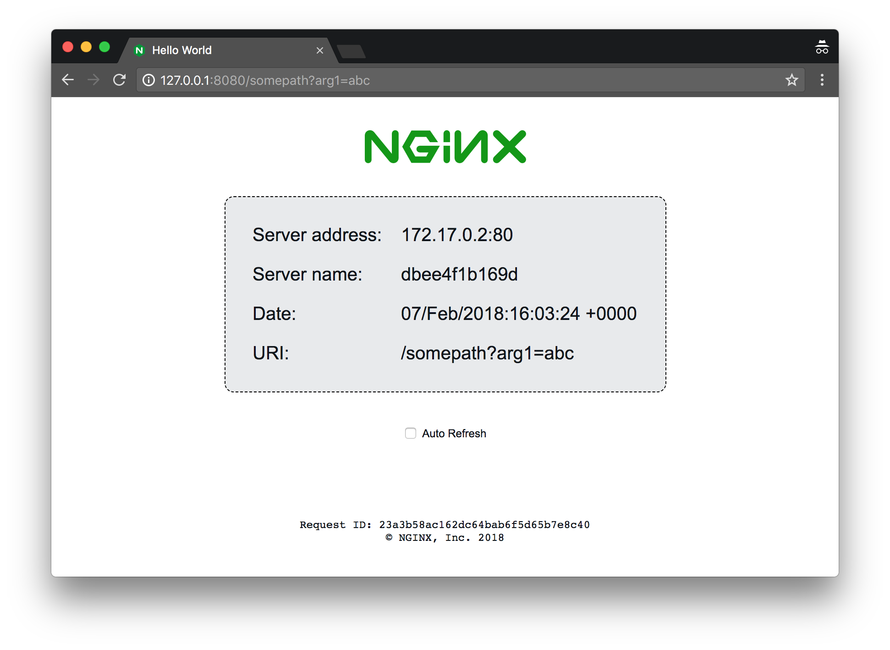

# NGINX webserver that serves a simple page containing its hostname, IP address and port as wells as the request URI and the local time of the webserver.

Modified from https://github.com/nginxinc/NGINX-Demos/tree/master/nginx-hello to run as non-root

The images are uploaded to Docker Hub -- https://hub.docker.com/r/datica/nginx-hello/.

How to run:
```
$ docker run -P -d datica/nginx-hello
```

Now, assuming we found out the IP address and the port that mapped to port 80 on the container, in a browser we can make a request to the webserver and get the page below: 

The images were created to be used as simple backends for various load balancing demos.
